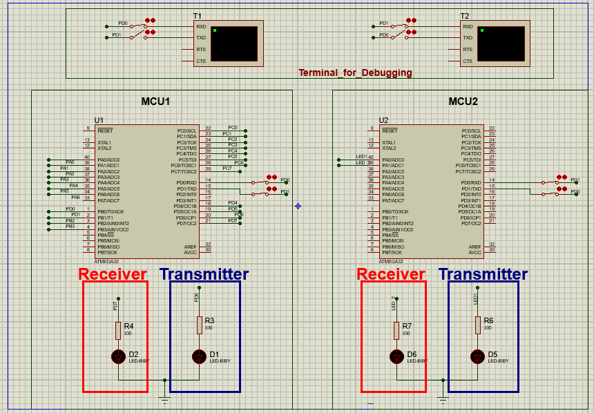

 
# Basic Communication Manager Task    

## Author

 
Bassel Yasser Mahmoud    

---
---
## Task Brief 
>The Basic Communication Manager module has a capability to work with different serial communication protocol using ISR with the highest possible throughput

---
## My work

**`BCM design Doc press here.......👉🏻 `** [Document](./Document/BCM.pdf)

**`Transmitter code Implementation.👉🏻`** [TX_code](./Code/Transmitter_code/)

**`Receiver code Implementation....👉🏻`** [RX_code](./Code/Receiver_code/)

**`Video...........................👉🏻`** [video](./Video/)

---

## Schematic
